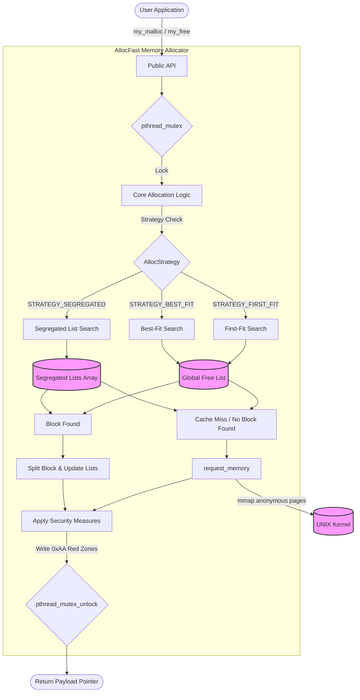
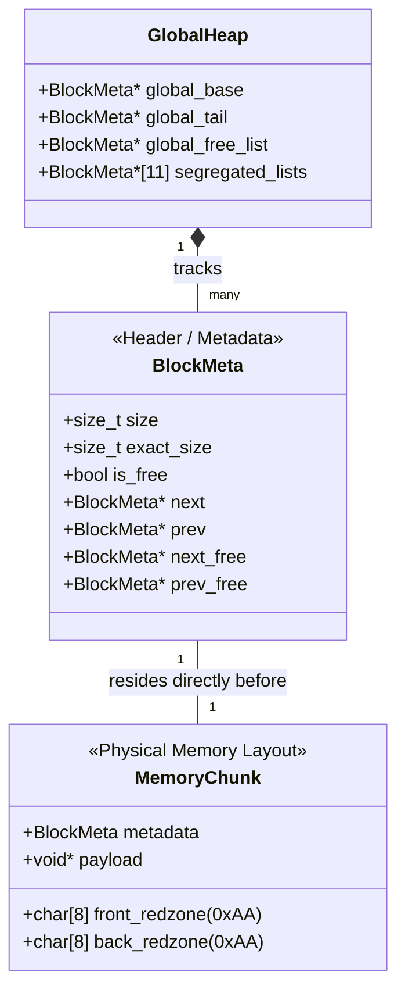

# AllocFast

A custom, thread-safe memory allocator written in C from scratch. AllocFast serves as a drop-in educational replacement for the standard library's `malloc` and `free`, built directly on top of UNIX system calls (`mmap`).

## What It Does

AllocFast implements custom memory management logic with multiple configurable allocation strategies. It features:
* **Multiple Allocation Strategies:** Supports **First-Fit**, **Best-Fit**, and **Segregated List** (SLUB-like) allocation patterns.
* **Thread Safety:** Fully synchronized using `pthread` mutexes to allow safe concurrent allocations across multiple threads.
* **Memory Protection (Red Zones):** Implements automated buffer overflow and underflow detection by padding allocations with "magic bytes" (0xAA). If a program writes outside its allocated bounds, `my_free` will catch the corruption and safely abort.
* **Micro-Benchmarking:** Includes an integrated benchmark suite to compare the speed of different allocation strategies against glibc's native `malloc` and `free`.

## Why It Was Created

I built this project to deepen my understanding of systems programming, operating system internals, and memory management. By bypassing the standard library and requesting memory pages directly from the kernel, this project served as a hands-on exploration of:
* Heap fragmentation and coalescing.
* Performance trade-offs between different search algorithms (First-Fit vs. Best-Fit).
* Concurrency controls and race conditions in low-level memory handling.
* Debugging tools and security mechanisms like Valgrind-style red zones.

## Architecture

AllocFast bypasses the standard library and uses `mmap` to request memory directly from the kernel. It supports multiple allocation strategies and uses red zones to detect memory corruption.

### 1. Control Flow

This diagram illustrates how allocations are routed through the custom thread-safe allocator:



### 2. Memory Layout (Red Zones)

This diagram shows the physical layout of a single allocated memory chunk, including the metadata node and the `0xAA` security boundaries (Red Zones) used to catch buffer overflows.



## How to Build

The project is written in standard C11 and requires a POSIX-compliant environment (Linux/macOS) due to the use of `mmap` and `pthread`. 

To compile the project, run the following commands from the root directory:

```bash
mkdir -p build
gcc -std=c11 -Wall -Wextra -Iinclude -pthread src/allocator.c -o build/allocfast
```

## How to Run

Running the compiled executable will automatically execute the internal micro-benchmark suite, followed by a memory protection test.

```bash
./build/allocfast
```

Expected Output:
1. Benchmark Results: You will see a performance comparison of 50,000 allocations/frees using glibc, First-Fit, Best-Fit, and Segregated Fit.
2. Normal Allocation Test: Verifies basic read/write persistence.
3. Red Zone Test: The program will intentionally simulate a buffer overflow and deliberately crash with a `[FATAL ERROR] Overflow detected` message. This confirms the security boundaries are actively protecting memory.
